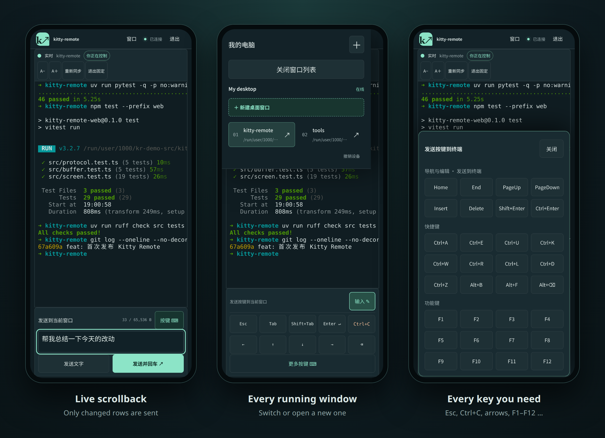
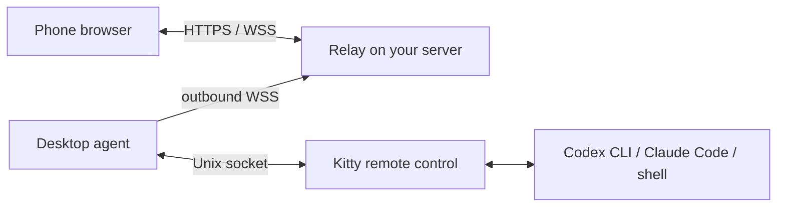

# Kitty Remote

[](https://www.python.org/)
[](LICENSE)

**Your running terminals, in your pocket.** Read and type into the Kitty windows already open on your Linux desktop — Codex, Claude Code, builds, plain shells — from your phone's browser. No tmux, no wrapper command, no inbound ports.

[简体中文](README.zh-CN.md) · [Architecture](docs/architecture.md) · [Deployment](docs/deployment.md)



## Why

You started something long in Kitty — an agent working through a refactor, a build, a migration — and then you had to leave your desk. Kitty Remote lets you pick up **that exact window** on your phone: scroll through everything it printed, answer its question, press Ctrl+C, or open a fresh shell. The task keeps running in the same process on your computer, and nothing had to be started inside tmux or a special wrapper beforehand.

## Features

**Read**
- Every Kitty window on every paired computer, with its title and working directory.
- The full scrollback (up to 16 MiB), loaded once and then kept current by sending only the rows that changed.
- Native, smooth scrolling: the view follows new output at the bottom and stays exactly where you are while you read, with a "back to latest" button when something new arrives.
- Faithful text rendering: 16/256/true colour, bold, italic, underline and inverse; CJK and emoji widths match Kitty's; wide lines scroll horizontally; adjustable font size that keeps your place.

**Type**
- Send text, or text followed by Enter; multi-line paste; sending waits until the input method has finished composing.
- A key bar for Esc, Tab, Shift+Tab, Enter, Ctrl+C, arrows and Backspace, plus Home/End, PageUp/PageDown, Insert/Delete, Shift/Ctrl+Enter, Ctrl+A/E/U/K/W/R/L/D/Z, Alt+B/F/Backspace and F1–F12.
- Drafts are kept per window, and every send gets a receipt.

**Manage**
- Open a new Kitty window with a shell in your home directory, and jump straight into it.
- One browser controls a window at a time; others watch read-only and can take over once control is released.
- A pinned layout for phones keeps the terminal, input box and send buttons on screen while the soft keyboard is open.

**Stay safe**
- Input reaches only the window you picked: targets are verified against the Kitty instance and window identity, and closed or reused windows are rejected.
- Requests are de-duplicated and expire after 10 seconds; if a connection drops, pending input is marked "uncertain" instead of being resent.
- A single admin account hashed with Argon2id, Secure/HttpOnly/SameSite=Strict session cookies, rate-limited sign-in and pairing, 8-character pairing codes that expire in 5 minutes, and instant device revocation. The relay stores only credential digests and never writes terminal content to disk.
- Terminal output is sanitized — clipboard writes, hyperlinks and other control sequences are stripped — and text is never interpreted as HTML.

**Deploy**
- Docker Compose with Caddy for automatic HTTPS, using a domain or just a public IP address (Let's Encrypt IP certificates).
- A template for servers that already run a reverse proxy.
- A systemd user service for the desktop agent and a read-only `doctor` check.

## How it works



A small agent on your desktop talks to Kitty through its remote-control socket and connects out to a relay you host. The relay serves the web app, handles sign-in and pairing, and forwards screen updates and input between your phone and the agent. See [docs/architecture.md](docs/architecture.md) for identities, input semantics and the update protocol.

## Quick start

Requirements: Linux desktop, Kitty (tested with 0.49), Python 3.12+, `uv`, and Node.js 24.

Enable remote control in `~/.config/kitty/kitty.conf`, then start a new Kitty instance:

```conf
allow_remote_control socket-only
listen_on unix:${XDG_RUNTIME_DIR}/kitty-remote-{kitty_pid}
```

Build the web app and start a local relay:

```bash
git clone https://github.com/srewoc/kitty-remote.git
cd kitty-remote
uv sync --locked
npm ci --prefix web && npm run build --prefix web
uv run kitty-remote create-admin --username admin
KR_DEV=1 KR_ORIGIN=http://127.0.0.1:8765 uv run kitty-remote relay
```

Open http://127.0.0.1:8765 and sign in. In another terminal, pair this desktop and start the agent:

```bash
uv run kitty-remote pair --relay http://127.0.0.1:8765 --allow-http --name 'My desktop'
uv run kitty-remote doctor
uv run kitty-remote agent
```

Enter the pairing code printed by `pair` in the web app, then select a window.

To use it from your phone on any network, put the relay behind HTTPS on a server and run the agent as a systemd user service — see [docs/deployment.md](docs/deployment.md).

## Scope

- Linux + Kitty, one admin account, one relay process. The web interface is currently in Chinese.
- Text only: images and terminal graphics are not rendered.
- Full-screen programs on the alternate screen show only their visible screen. To scroll their history from the phone, run Claude Code with `/tui default` or Codex with `--no-alt-screen` so it stays in Kitty's scrollback.
- The relay is trusted: it can read terminal content in transit. Anyone who can sign in can type into paired windows. See [SECURITY.md](SECURITY.md).

## Development

```bash
uv sync --locked
npm ci --prefix web
uv run ruff check src tests scripts
uv run pytest
npm run typecheck --prefix web
npm test --prefix web
```

`uv run python scripts/e2e.py` runs an end-to-end check with an isolated Kitty instance, relay, agent and headless Chromium (install it once with `uv run playwright install chromium`). It needs a desktop session and only types into the windows it creates. After upgrading Kitty, regenerate the character width table with `kitty +launch scripts/gen_widths.py`. Contributions are welcome — see [CONTRIBUTING.md](CONTRIBUTING.md).

## License

[MIT](LICENSE)
