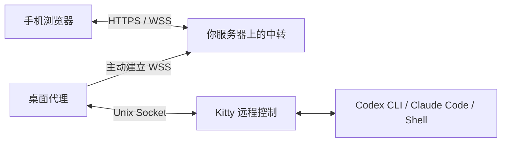

# Kitty Remote

[](https://www.python.org/)
[](LICENSE)

**把正在运行的终端装进口袋。** 用手机浏览器查看并操作 Linux 桌面上已经打开的 Kitty 窗口，无论里面跑的是 Codex、Claude Code、构建任务还是普通 Shell。不需要 tmux，不需要包装命令，也不需要开放入站端口。

[English](README.md) · [架构](docs/architecture.md) · [部署](docs/deployment.md)


## 为什么需要它

你在 Kitty 里启动了一个耗时的任务，比如让 Agent 重构代码、跑一次构建或数据迁移，然后不得不离开电脑。Kitty Remote 让你在手机上接回**那个窗口本身**：翻看它输出的所有内容，回答它的提问，按 Ctrl+C，或者新开一个 Shell。任务始终在电脑上的原进程里运行，也不需要事先在 tmux 或特定的包装命令里启动。

## 功能

**查看**
- 列出每台已配对电脑上的所有 Kitty 窗口，显示标题和工作目录。
- 完整的回滚历史（最多 16 MiB）只在首次打开时加载一次，之后只发送有变化的行。
- 原生、流畅的滚动：停在底部时跟随新输出，阅读时位置纹丝不动；有新内容时出现“回到最新”按钮。
- 忠实的文字渲染：支持 16/256/真彩色，以及粗体、斜体、下划线和反色；中日韩字符和 emoji 的宽度与 Kitty 一致；宽行可横向滚动；调整字号时保持阅读位置。

**输入**
- 发送文字，或发送文字后回车；支持多行粘贴；输入法组合输入完成前不会发送。
- 按键栏提供 Esc、Tab、Shift+Tab、Enter、Ctrl+C、方向键和 Backspace，另有 Home/End、PageUp/PageDown、Insert/Delete、Shift/Ctrl+Enter、Ctrl+A/E/U/K/W/R/L/D/Z、Alt+B/F/Backspace 以及 F1–F12。
- 每个窗口的草稿单独保留，每次发送都有回执。

**管理**
- 新建一个 Kitty 窗口，在主目录中打开 Shell，并直接切换过去。
- 同一窗口同时只有一个浏览器可以控制，其他连接只读，控制权释放后可以接管。
- 手机固定布局：弹出软键盘时，终端、输入框和发送按钮都保持在屏幕内。

**安全**
- 输入只会到达你选中的窗口：目标会校验 Kitty 实例和窗口身份，窗口关闭或 ID 被复用时拒绝旧目标。
- 请求去重，10 秒后过期；连接中断时，未确认的输入标记为“结果不确定”，不会自动重发。
- 单个管理员账号，密码用 Argon2id 哈希；会话 Cookie 带 Secure、HttpOnly、SameSite=Strict；登录和配对接口有限流；8 位配对码 5 分钟内有效，设备可随时撤销。中转只保存凭据摘要，从不把终端内容写入磁盘。
- 终端输出经过清洗，剪贴板写入、超链接等控制序列会被移除，文字永远不会被当作 HTML 解析。

**部署**
- 使用 Docker Compose 和 Caddy 自动配置 HTTPS，域名或公网 IP 均可（Let's Encrypt IP 证书）。
- 提供适用于已有反向代理服务器的模板。
- 提供桌面代理的 systemd 用户服务，以及只读的 `doctor` 检查命令。

## 工作原理



桌面上的轻量代理通过 Kitty 的远程控制 Socket 与 Kitty 通信，并主动连接到你部署的中转。中转提供网页、负责登录和配对，并在手机与代理之间转发画面更新和输入。身份校验、输入语义和更新协议详见 [docs/architecture.md](docs/architecture.md)。

## 快速开始

环境要求：Linux 桌面、Kitty（已在 0.49 上测试）、Python 3.12+、`uv` 和 Node.js 24。

在 `~/.config/kitty/kitty.conf` 中启用远程控制，然后新开一个 Kitty 实例：

```conf
allow_remote_control socket-only
listen_on unix:${XDG_RUNTIME_DIR}/kitty-remote-{kitty_pid}
```

构建网页并启动本地中转：

```bash
git clone https://github.com/srewoc/kitty-remote.git
cd kitty-remote
uv sync --locked
npm ci --prefix web && npm run build --prefix web
uv run kitty-remote create-admin --username admin
KR_DEV=1 KR_ORIGIN=http://127.0.0.1:8765 uv run kitty-remote relay
```

打开 http://127.0.0.1:8765 并登录。在另一个终端中配对这台电脑并启动代理：

```bash
uv run kitty-remote pair --relay http://127.0.0.1:8765 --allow-http --name '我的电脑'
uv run kitty-remote doctor
uv run kitty-remote agent
```

在网页中输入 `pair` 命令显示的配对码，然后选择窗口。

如果要在任何网络下用手机访问，把中转部署到服务器并放在 HTTPS 之后，再把代理作为 systemd 用户服务运行，详见 [docs/deployment.md](docs/deployment.md)。

## 适用范围

- 仅支持 Linux + Kitty，单个管理员账号，中转以单进程运行。网页界面目前为中文。
- 只显示文字，不渲染图片和终端图形。
- 运行在备用屏幕上的全屏程序只能看到当前一屏。如果想在手机上翻看它们的历史，可以在 Claude Code 中使用 `/tui default`，或给 Codex 加上 `--no-alt-screen`，让历史保留在 Kitty 的回滚区。
- 中转是受信任的：它能读取经过的终端内容。任何能登录的人都可以向已配对的窗口输入。详见 [SECURITY.md](SECURITY.md)。

## 开发

```bash
uv sync --locked
npm ci --prefix web
uv run ruff check src tests scripts
uv run pytest
npm run typecheck --prefix web
npm test --prefix web
```

`uv run python scripts/e2e.py` 会启动独立的 Kitty 实例、中转、代理和无头 Chromium，做端到端检查。首次运行前用 `uv run playwright install chromium` 安装浏览器。它需要桌面会话，并且只向自己创建的窗口输入。升级 Kitty 后，用 `kitty +launch scripts/gen_widths.py` 重新生成字符宽度表。欢迎贡献，详见 [CONTRIBUTING.md](CONTRIBUTING.md)。

## 许可证

[MIT](LICENSE)
