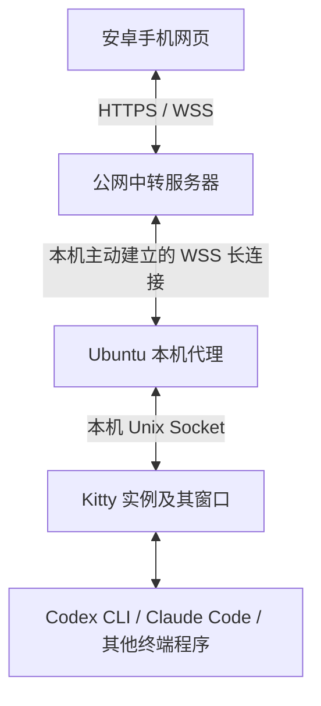

> 历史设计草案，保留最初讨论。当前实现与运行状态见 [README](../README.md) 和 [验证记录](verification.md)。

# Kitty Remote 项目方案

状态：方案草案，尚未实现或部署。本文记录已确认需求、建议设计和待验证边界，供后续开发使用。

## 1. 项目目标

让用户在外面使用安卓手机，查看并操作 Ubuntu 电脑上已经运行的 Kitty 终端会话，主要用于 Codex CLI 和 Claude Code。

用户继续在电脑上使用 Kitty。手机打开网页，选择窗口，即可查看不断更新的终端内容、发送中文任务和操作按键；回到电脑后继续操作同一个任务。重点是阅读清楚、输入方便、会话不串线。

用户希望获得接近实时远控的效果。本方案选择 Kitty 远程控制接口作为接入基础，首版提供终端文字与格式同步，不承诺等同于原始像素视频投屏。

## 2. 已确认的需求与范围

| 项目 | 约定 |
| --- | --- |
| 手机 | 安卓；首版使用适配手机的网页，可考虑作为 PWA 添加到主屏幕 |
| 电脑 | Ubuntu，使用 Kitty 启动终端任务 |
| 使用地点 | 外网是主要场景，从第一版就接入中转服务器 |
| 操作对象 | 电脑上现有 Kitty 窗口中的同一个进程与会话 |
| 输入 | 中文、长段文字、粘贴、手机输入法提供的语音转文字、常用控制按键 |
| 输出 | 持续更新的终端内容、颜色、历史阅读；具体还原程度需要验证 |
| 使用约束 | 不要求用户通过 SSH 操作，不引入 tmux 作为会话接入前提 |
| 开发约定 | 如采用 Python，使用 uv 管理项目和依赖，创建 .venv 开发 |

桌面版 Codex、编辑器窗口等完整 GUI 控制属于此前讨论过的使用需求，但不在本项目首版 Kitty 接口能力范围内。后续若要统一覆盖，需要另外加入桌面捕获与输入通道，不能将其当作 Kitty 接口已经具备的能力。

## 3. 总体架构

本机代理和手机都主动连接公网服务器。Ubuntu 不需要公网 IP，也不要求路由器端口映射。Kitty Socket 留在本机，不直接开放到公网。

中转服务器属于正式架构的一部分，不以局域网直连作为首版交付方案。

### 3.1 安卓网页

- 登录并选择已配对电脑，展示在线、离线、连接中等状态。
- 列出 Kitty 实例、标签页和窗口，显示标题与可用的工作目录信息。
- 展示当前窗口内容，支持调字号、横竖屏、暂停跟随、回到最新内容。
- 提供独立多行输入框，适配中文输入法；明确区分“发送文字”和“发送并回车”。
- 提供 Enter、Esc、Tab、方向键、Ctrl+C 等按钮，按键映射需要逐项验证。
- 显示输入的发送、已执行、失败或结果不确定状态。

### 3.2 Ubuntu 本机代理

- 发现并连接允许访问的 Kitty 实例，维护实例与窗口标识。
- 调用 Kitty 控制接口获取窗口列表、读取屏幕、发送文字或控制按键。
- 采样屏幕内容、比较变化，通过中转服务器发送更新。
- 校验输入目标与请求有效期，处理重复请求和窗口失效。
- 主动维持 WSS 连接，断线重连，重新报告当前实例和窗口状态。
- 首版建议以桌面用户的 systemd 用户服务运行，不需要 root。

### 3.3 中转服务器

- 托管手机网页，提供 HTTPS/WSS 接入。
- 处理用户登录、设备配对、令牌撤销及设备访问权限。
- 管理手机与本机代理的连接关系，按授权目标转发消息。
- 提供心跳、连接状态、消息大小限制、速率限制与背压。
- 默认不持久化终端正文，不把用户输入和令牌写入日志。

## 4. Kitty 接入方式与边界

Kitty 已有 Remote Control 接口，可通过本机 Socket 调用。首版可先使用 kitten 命令行客户端封装，再根据测量结果决定是否直接实现 Socket 协议。

| 能力 | 接口或实现方向 | 边界 |
| --- | --- | --- |
| 列出窗口 | ls | 要区分多个 Kitty 实例 |
| 读取输出 | get-text | 获取文字快照，不是原始 PTY 输出流或视频 |
| 保留格式 | get-text 的 ANSI 格式输出 | 具体参数及格式还原依赖安装版本，需验证 |
| 输入文字 | send-text | 必须显式匹配窗口，不依赖当前焦点 |
| 输入按键 | 版本支持的按键接口或编码序列 | 必须测试程序模式及 Kitty 键盘协议差异 |
| 新建或切换窗口 | launch、focus-window 等 | 列为后续功能，首版优先接管现有窗口 |

### 4.1 接管现有会话的前提

目标 Kitty 实例必须已经启用可访问的远程控制 Socket，并允许所需命令。不能承诺随时接管一个从未开启接口的既有实例。

安装时先检查当前配置和运行状态。若需要重启 Kitty 才能启用接口，应提示用户先保存或结束正在运行的任务；不能为启用远控自动关闭终端。配置示例应在验证用户安装版本后提供，采用最小必要权限。

### 4.2 屏幕同步设计

首版采用文字快照方案：本机代理按需采样指定窗口，内容变化时发送完整快照，手机替换当前屏幕视图。先保证一致性，再考虑差分传输。

- 建议起始采样间隔为活动时 200～500 ms，空闲时降低频率；这是待测参数，不是延迟承诺。
- 每个快照携带目标标识、序号、采样时间和可获取的终端尺寸信息。
- 手机丢弃旧序号；重新连接后获取完整快照。
- 仅订阅用户正在查看的窗口，限制历史读取量和消息大小。
- 连接慢时可以丢弃旧屏幕快照并保留最新一份；输入消息不能按此规则丢弃或合并。
- 手机本地滚动与电脑上的终端滚动分别处理，用户阅读历史时不自动拉回底部。

快照不能直接作为连续终端流不断追加到 xterm.js，否则会重复内容。需要快照渲染器，或经过验证的清屏、定位与重绘逻辑；不能将 get-text 返回值假定为完整终端状态。

### 4.3 显示能力的限制

- get-text 不提供完整桌面视频；终端内图片、动画等不能默认按原样还原。
- 光标、备用屏幕、全屏 TUI、颜色、宽字符与历史区需要分别验证。
- 调整手机字号不等于终端自动按手机宽度重新排版。首版优先保留终端行列结构，允许缩放与横向查看。
- 如果后续提供独立的阅读模式，可重排纯文本，但需要与保留终端布局的模式明确区分。
- 不默认改变电脑窗口尺寸，因为这会影响正在运行的程序和本地显示。
- 首版不承诺通用鼠标控制；审批选项等交互优先使用经过验证的键盘操作。

## 5. 外网连接、配对与安全边界

建议首版面向单用户、多 Kitty 窗口、一台 Ubuntu 电脑；协议预留设备 ID，后续再扩展多电脑。

1. 在公网服务器配置域名与 TLS，手机通过 HTTPS 打开页面。
2. 本机代理首次连接，生成或获取限时配对请求。
3. 用户登录网页，输入配对码并确认电脑信息，服务器建立授权关系。
4. 本机代理保存可撤销的设备凭据，之后自动重连。
5. 手机选择目标窗口后订阅输出，并获得对应的操作权限。

登录方式、服务器地址、部署环境及证书管理尚未确定，实施时再选定；不得把配对码当作永久登录凭据。

安全要求：

- 每次订阅和输入都检查用户是否拥有目标设备访问权限。
- 浏览器连接校验来源及登录会话；用户退出或权限撤销后终止对应控制连接。
- 本机仅开放允许的 Kitty 操作，不暴露任意 shell 命令执行接口。
- 调用 kitten 时采用参数数组，避免将用户文字拼接为 shell 命令。
- ANSI 输出按受限格式解析，禁止将终端内容当作 HTML 执行，禁止自动执行输出中的剪贴板写入或外部请求。
- 不默认公开文件系统浏览、文件删除或远程升级能力。

首版按“可信的自有中转服务器”设计：TLS 保护各段传输，但服务器原则上可以看到转发内容。端到端加密尚未设计，不能宣称中转服务器无法读取内容。

## 6. 输入路由与可靠性

输入目标建议由 device_id、agent_epoch、kitty_instance_id、window_id 共同标识。agent_epoch 在代理重启时变化；Kitty 实例重启或身份无法确认时重新生成实例标识。

这样即使窗口 ID 被重用，也不会把旧页面的输入发送到新窗口。代理在执行前重新校验目标存在且属于当前实例，失效时拒绝执行，不回退到焦点窗口。

输入请求至少包含：request_id、目标标识、操作类型、负载、有效期。对同一目标串行执行，避免文字与回车乱序。首版同一窗口只允许一个手机控制者，其他连接只读；电脑键盘仍可同时输入，用户需要避免两端同时编辑同一行。

### 6.1 回执语义

| 状态 | 含义 |
| --- | --- |
| 待发送 | 尚未提交网络连接 |
| 已接收 | 中转或代理已收到，不能据此宣称 Kitty 已执行 |
| 已执行 | 代理确认 Kitty 控制操作成功；不代表终端里的业务任务已完成 |
| 已拒绝／失败 | 目标失效、权限不足、请求过期或接口调用失败 |
| 结果不确定 | 发送后断线或进程退出，无法确认是否已产生副作用 |

代理在当前运行周期内维护有界去重记录：重复 request_id 返回原回执，不能再次执行。去重记录过期或代理重启时，不自动补发旧输入。

本方案不承诺跨崩溃严格“恰好执行一次”。尤其在 Kitty 已接受输入但回执丢失时，手机应显示结果不确定，刷新屏幕后由用户判断，不能盲目重试 Ctrl+C、回车或其他命令。

### 6.2 断线恢复

- 手机断开：电脑上的任务继续运行；恢复后重新登录校验、订阅窗口并获取完整快照。
- 代理与中转断开：指数退避重连，网页显示设备离线，不积压离线输入等待稍后执行。
- Kitty 窗口关闭：结束该目标的订阅并提示窗口已关闭。
- Ubuntu 休眠、重启或 Kitty 退出：任务是否存活由本机程序决定；本项目不提供进程持久化或自动恢复任务保证。

## 7. 建议技术栈

以下为建议选型，尚未通过原型验证。

| 部分 | 建议 |
| --- | --- |
| 本机代理 | Python，异步网络连接，封装 kitten 调用 |
| 中转服务 | Python + FastAPI + WebSocket |
| 手机网页 | TypeScript，移动端布局与受限 ANSI 渲染；框架待定 |
| Python 环境 | uv、pyproject.toml、uv.lock、.venv |
| 代理运行 | systemd 用户服务 |
| 公网入口 | Caddy 或 Nginx 提供 HTTPS/WSS |
| 持久化 | 单实例初期可用 SQLite 保存用户、设备、令牌摘要；不存终端正文 |

不要求使用 Rust。当前更重要的是会话正确性、中文输入和显示体验，语言性能是否成为瓶颈需要测量。中转首版按单实例部署，水平扩展与跨节点连接路由不属于首版范围。

## 8. 实施顺序与验收

从第一阶段就走真实中转服务器链路，不用局域网演示代替外网验收。

### 阶段一：验证完整链路与 Kitty 能力

- 检查本机 Kitty 版本、Socket、窗口发现和权限配置。
- 部署最小中转服务，本机主动连接，安卓使用移动网络接入。
- 读取一个指定窗口、发送中文和回车，确认手机与电脑操作同一个任务。
- 验证 get-text 对 Codex CLI、Claude Code、备用屏幕与格式的表现。

通过标准：外网读写成功，目标窗口明确，没有新建替代任务或依赖 SSH/tmux。若快照方案不能满足核心阅读需求，先修订方案，不把不完整表现描述为远控已完成。

### 阶段二：完成手机操作体验

- 窗口列表、字号调整、历史阅读、暂停跟随和回到最新。
- 多行中文输入、语音转文字结果发送、粘贴与常用按键栏。
- 补全登录配对、令牌撤销和连接状态。

通过标准：安卓实际完成“发任务—查看长回复—操作选择项—中断任务—切换窗口”，并确认输入法组合文字不会被提前发送。

### 阶段三：补全可靠性与部署

- 请求去重、目标失效处理、旧窗口标识拒绝、断线恢复与背压。
- 服务自启动、受限日志、安装与卸载说明。
- 给出外网测试条件、刷新延迟与输入回显测量结果。

重点验收矩阵：

| 场景 | 预期 |
| --- | --- |
| Wi-Fi 切换为手机流量 | 重新连接并同步当前屏幕，不自动重发旧输入 |
| 手机锁屏后返回 | 明确显示连接状态，恢复后展示新快照 |
| 两个 Kitty 窗口来回切换 | 输入严格命中所选窗口 |
| Kitty 退出或代理重启 | 旧绑定失效，不复用到其他窗口 |
| 重复请求与回执丢失 | 不盲目重复执行，不能确认时显示结果不确定 |
| 中文、Emoji、长段粘贴 | 内容不丢失、不截断，回车行为符合选择 |
| 快速刷屏和慢网络 | 控制内存与队列，显示最新状态 |
| 无权限设备或过期会话 | 拒绝读取和输入 |

## 9. 当前状态与待确认事项

目前仅创建了项目目录和本文档，没有代码、虚拟环境、部署服务或实测结果。

实施前需要确认：

- 中转服务器的地址、系统、域名与可用部署权限。
- 本机 Kitty 版本及现有任务能否在不重启的前提下接入接口。
- 安卓浏览器、输入法，以及用户对文字快照还原效果的接受程度。
- 首版登录方式、是否需要端到端加密。
- 屏幕刷新频率、带宽、耗电与长回复阅读的实际表现。

## 10. 参考资料与方案定位

- [Kitty 官方 Remote Control 文档](https://sw.kovidgoyal.net/kitty/remote-control/)：窗口发现、输出读取及输入控制接口。
- [Kitty 远程控制协议](https://sw.kovidgoyal.net/kitty/rc_protocol/)：直接对接 Socket 时的协议参考。
- [tui-browser](https://github.com/AJV009/tui-browser)：手机网页与 Kitty 集成的参考实现，但会话同步依赖 tmux，不满足本项目直接接入的约束。
- [kitty-rc-rs](https://github.com/rektide/kitty-rc-rs)：Rust 控制协议库，可参考协议封装，不是完整手机遥控器，也不意味着必须选 Rust。

此前检索尚未确认有完整满足“安卓网页 + 直接 Kitty 接口 + 现有窗口 + 无 SSH/tmux”条件的开源成品。该结论仅表示尚未找到，不能据此断言不存在。
